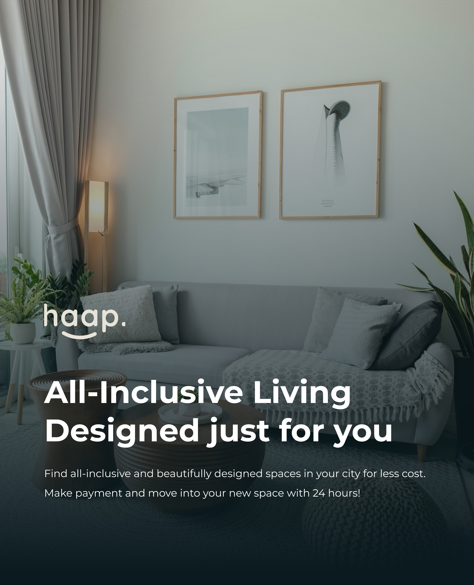

# happ-verification

<!DOCTYPE html>
<html lang="en">
<head>
    <meta charset="UTF-8">
    <meta name="viewport" content="width=device-width, initial-scale=1.0">
    <title>Verification 1</title>
    <link rel="preconnect" href="https://fonts.googleapis.com">
    
    <link rel="stylesheet" href="style.css">
</head>
<body>    
    

		

			
		

		

			

				
				<h1 class="text-[34.9px] font-medium md:text-[51px]">Verification</h1>
				
Complete your KYC verification for compliance purposes  
					in just 4 simple steps
				

				<!-- Progress Bar -->
				
	
					

						

							

								1</i>
							

						

						

							

								

							

						

					
						
						

							

								2</i>
							

						

						

							

								

							

						

					
						

							

								3</i>
							

						

						

							

								

							

						

						

							

								4</i>
							

						
	
					

				

				<!-- Form -->
				

					<h1 class="text-[24px] font-medium md:text-[33px]">Email Verification</h1>
					

						Enter the code sent to your email address
                        to continue with verification
					

                    

                        <input class="border-2 h-14 w-14 text-center font-semibold border-[#0A1A1F] text-xl form-control rounded-lg" type="text" id="first" maxlength="1" /> 
                        <input class="border-2 h-14 w-14 text-center font-semibold border-[#0A1A1F] text-xl form-control rounded-lg" type="text" id="second" maxlength="1" /> 
                        <input class="border-2 h-14 w-14 text-center font-semibold border-[#0A1A1F] text-xl form-control rounded-lg" type="text" id="third" maxlength="1" /> 
                        <input class="border-2 h-14 w-14 text-center font-semibold border-[#0A1A1F] text-xl form-control rounded-lg" type="text" id="fourth" maxlength="1" />
                    

					<button class="mt-5 w-full bg-[#3284A0] rounded-lg p-3 text-base text-white">Submit</button>
                    

						Didn’t receive an email? 
                        
                            Resend 03
                        
					

				

			

		

	

</body>
</html>